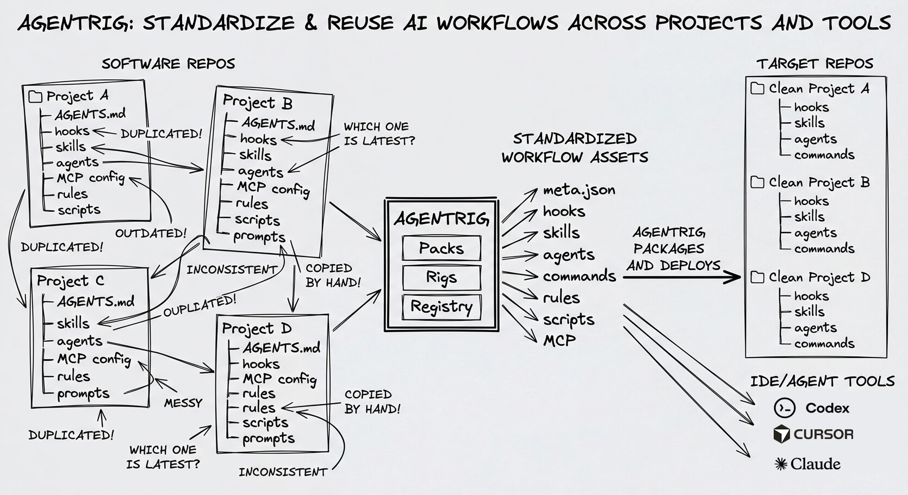

# agentrig


**Create and install AI workflow plugins - bundles of skills, agents, MCP servers, commands, and other assets - and share them as native Claude Code, Codex, and Cursor plugins.**

Features:

- create your own plugins and registries
- install registry-backed plugins from signed registries
- share plugins with your team or the community

# Why AgentRig exists

coding agents like Claude Code, Codex, and Cursor all support things like skills, agents, hooks, commands, and MCP servers, but teams still end up copying that setup across repos and tools by hand. That creates duplicated workflows, drift, and "which version is latest?" problems. AgentRig turns that setup into versioned plugins and registries so you can author once, install natively where people already work, and share updates with your team or the community.



> Warning: AgentRig is under active development. Expect breaking changes while the product contract settles.

## Install the CLI

```bash
npm install -g agentrig
agentrig --help
```

Full documentation lives at [docs.agentrig.ai](https://docs.agentrig.ai/).

## Most Common Use Case

If you want to install a plugin from the official registry:

```bash
agentrig init
agentrig list --available
agentrig view agentrig/agentrig.core-committer@0.1.0
agentrig plugin install codex agentrig/agentrig.core-committer@0.1.0
```

`agentrig init` seeds your config with the official registry. `agentrig list` shows what you already have installed, while `agentrig list --available` shows plugins you can install.

## Use A Third-Party Registry

If a team or publisher gives you a registry URL, add it explicitly and install from that alias:

```bash
agentrig registry add georg https://georg.dev/agentrig
agentrig list --available --registry georg
agentrig plugin install cursor georg/georg.ts-master-plugin@1.2.0
```

## Public Install Contract

Public installs are registry-only:

- exact registry alias
- exact plugin id
- exact version
- exact signed registry state
- exact digest-verified plugin snapshot

Direct URLs, local `.plugin/plugin.json` paths, ZIPs, and author repos are not part of the public install surface.

## Quick Vocabulary

- A `plugin` is a bundle of skills, agents, MCP servers, commands, and related files.
- A `registry` is an install source only when it is a configured static signed registry.
- A `directory` is a discovery surface. Being listed there does not make a plugin installable.
- A `provider` is where the plugin gets installed: Claude Code, Codex, or Cursor.
- A `rig` is an advanced team setup that applies multiple plugins together.

AgentRig publicly installs plugins only from static signed registries via:

- the seeded `agentrig` registry
- an added third-party registry via `<registryAlias>/<namespace.plugin>@<version>`

## Install Or Remove A Plugin

Once a plugin resolves, you can install or uninstall it for a provider:

```bash
agentrig plugin install claude agentrig/agentrig.core-committer@0.1.0
agentrig plugin install codex georg/georg.ts-master-plugin@1.2.0 --scope workspace
agentrig plugin uninstall codex georg/georg.ts-master-plugin@1.2.0 --scope workspace
```

`--scope` controls where the native plugin is installed:

- `--scope personal` installs it in your user-level agent/editor profile.
- `--scope workspace` keeps it repo-local so it lives with the current project.
- `--scope auto` is the default for installs. It resolves to `workspace` for Claude Code and Codex, and to `personal` for Cursor.

AgentRig tracks plugin installs in its own ledger so uninstall keeps working even if a registry is later removed or temporarily offline.

## For Plugin Authors And Publishers

Create a local plugin:

```bash
agentrig plugin init my-plugin
agentrig plugin create my-plugin
```

Export local plugins as provider-native plugin marketplaces:

```bash
agentrig plugin export --agent all --pluginsDir ../agentrig-registry/plugins --out dist/plugins
```

Teams that want to apply multiple plugins together can use rigs:

```bash
agentrig rig apply codex my-rig --scope workspace
```

## Documentation

- [Getting Started](https://docs.agentrig.ai/getting-started)
- [Integrations](https://docs.agentrig.ai/integrations)
- [CLI Reference](https://docs.agentrig.ai/cli)
- [Plugins](https://docs.agentrig.ai/plugins)
- [Registry](https://docs.agentrig.ai/registry)
